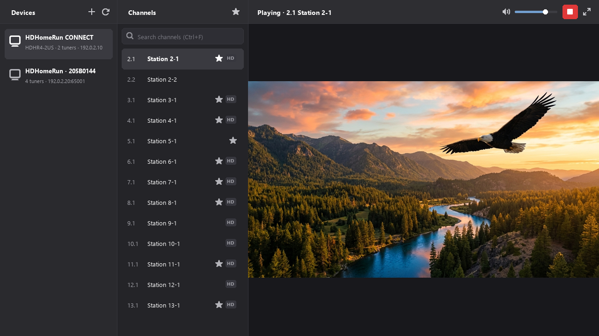

# Balun

[](LICENSE)
[](https://github.com/jm2/balun/actions/workflows/ci.yml)

A lightweight, cross-platform **HDHomeRun live TV viewer** written in Rust with **GTK 4**,
**libadwaita**, and **GStreamer**.

Balun lists every HDHomeRun on your network in one sidebar, shows the selected device's own
channel lineup in a second, and plays unprotected channels in a live-video pane. Lineups are never
merged across devices, no stream URL ever reaches the user interface, and the media framework
receives neither a device address nor a stream URL. Playback errors may name the device and its
address so you know which tuner failed.



> **v0.1.0.** Balun plays live TV on Linux, macOS, and Windows and has been verified against real
> tuners. Pre-built packages are on the [Releases](https://github.com/jm2/balun/releases) page;
> the countable status is in [`docs/task.md`](docs/task.md).

## Features

| Feature | Status |
|---------|--------|
| Local HDHomeRun discovery (IPv4 broadcast, IPv6 multicast) | ✅ |
| Find a routed tuner by IP address or hostname (WireGuard and other tunnels) | ✅ Remembered across launches |
| Approved private-range enumeration (`balun-discover` only, `/24` or narrower) | ✅ |
| Multiple devices, each with its own channel lineup | ✅ |
| Device metadata and lineup inspection without allocating a tuner | ✅ |
| Reload the selected device's channels after a failure or lineup change | ✅ **Reload channels** in the channel header |
| Adaptive three-pane GTK 4 / libadwaita window | ✅ |
| Window size and maximized state remembered across launches | ✅ |
| Live playback of unprotected channels (`playbin3` + `gtk4paintablesink`) | ✅ Verified on Linux, macOS, and Windows against real tuners |
| Stop, volume, mute, and fullscreen controls | ✅ |
| Software deinterlacing | ✅ Adaptive YADIF, automatic field order, full field rate; progressive video passes through |
| Keep the display and computer awake during playback | ✅ While playing or buffering, where the desktop permits inhibition |
| Favorite, HD, and protected channel badges | ✅ Protected channels are listed but disabled |
| Playback errors that name the device and channel | ✅ |
| Channel search and favorites-only filter | ✅ |
| Fixed, endpoint-free playback error messages | ✅ |
| Windows local discovery | ✅ |
| Network-change handling | 🚧 Linux: stale addresses expire and routed scans stop when adapters or routes change, and nothing rescans on its own; macOS and Windows in a future release |
| Route-table-derived tunnel discovery | 🚧 Linux: approve each route set once, verified across an owned routed WireGuard tunnel; macOS and Windows in a future release |
| Program guide (in-band PSIP/EIT, XMLTV) | 🚧 Future release |
| Hostname entry | ✅ Resolved to at most four unicast addresses; remembered by name |
| Audible output and complete codec contract | ✅ Audio verified across Linux, macOS, and Windows; live timing accounts for delayed media arrival; codec contract frozen, see the support matrix |
| ATSC 3.0 channels | ⚠️ HEVC video needs gst-libav or a platform decoder; AC-4 audio has no open decoder |
| Protected (DRM) channels | ❌ Out of scope |
| Packages (Flatpak, deb, rpm, Arch, DMG, Windows ZIP/installer) | ✅ Direct downloads from the Releases page; Fedora COPR; no AUR or winget yet |
| Cross-platform: Linux, macOS, Windows | ✅ Linux, macOS, and Windows verified with real tuners; live playback and audio confirmed |
| Light & dark mode | ✅ Automatic (libadwaita) |

Route-table-derived tunnel discovery and network-change handling are the two Linux-only features
today. Local broadcast and multicast discovery, exact IP or hostname discovery, and remembered
targets work on Linux, macOS, and Windows.

The product plan is [`docs/plan-v0.1.md`](docs/plan-v0.1.md), the countable ledger is
[`docs/task.md`](docs/task.md), sanitized hardware observations are in
[`docs/compatibility-v0.1.md`](docs/compatibility-v0.1.md), the evidence-backed support matrix is
[`docs/support-v0.1.md`](docs/support-v0.1.md), the playback contract is in
[`docs/playback.md`](docs/playback.md), and the v0.1 security and privacy review is in
[`docs/security-review-v0.1.md`](docs/security-review-v0.1.md).

---

## Architecture

```text
┌─────────────────────────────────────────────────────────────┐
│ GTK 4 / libadwaita UI                                       │
│ device sidebar · channel sidebar · live-TV player           │
├─────────────────────────────────────────────────────────────┤
│ Controller: one Tokio worker publishing URL-free snapshots  │
├──────────────────────────────┬──────────────────────────────┤
│ HDHomeRun core               │ Playback                     │
│ discovery · registry ·       │ session · source policy ·    │
│ device HTTP · lineup         │ HTTP transport → appsrc →    │
│                              │ playbin3 → gtk4paintablesink │
└──────────────────────────────┴──────────────────────────────┘
```

The GTK layer only ever sees stable device and channel identities plus immutable, URL-free
snapshots published by one controller thread. Stream URLs stay inside the controller and the
playback library.

GStreamer never receives a device address either. `playbin3` is given the constant
`appsrc://balun` URI, and Balun's own HTTP client, with proxies, redirects, and DNS disabled,
fetches the MPEG-TS stream and feeds the built-in `appsrc`.
[ADR-0001](docs/architecture/adr-0001-discovery-playback.md) records that decision.

---

## Installation

Pre-built packages for Linux (Flatpak, `.deb`, `.rpm`, Arch), macOS (`.dmg`), and Windows
(`.exe` installer, `.zip`) are available on the [Releases](https://github.com/jm2/balun/releases)
page. Fedora users can install from COPR instead. Balun does not yet publish through the AUR or
winget. Download `SHA256SUMS.txt` with the package and verify its SHA-256 entry before installing.

### Fedora (COPR)

Balun is available from the [jmsqrd/balun](https://copr.fedorainfracloud.org/coprs/jmsqrd/balun/)
COPR repository for Fedora 44 and 45 (x86_64, aarch64):

```bash
sudo dnf copr enable jmsqrd/balun
sudo dnf install balun
```

### Linux

| Distribution | Assets |
| --- | --- |
| Any (Flatpak) | `balun-linux-x86_64.flatpak`, `balun-linux-aarch64.flatpak` |
| Debian / Ubuntu | `balun-amd64.deb`, `balun-arm64.deb` |
| Fedora / RPM-based | `balun-x86_64.rpm`, `balun-aarch64.rpm` |
| Arch Linux | `balun-x86_64.pkg.tar.zst` |

```bash
flatpak install --user ./balun-linux-x86_64.flatpak
sudo apt install ./balun-amd64.deb
sudo dnf install ./balun-x86_64.rpm
sudo pacman -U ./balun-x86_64.pkg.tar.zst
```

Native packages need GTK 4.16 and libadwaita 1.6 from the distribution; use the Flatpak where the
host repositories are older.

### macOS

Apple Silicon: `balun-macos-aarch64.dmg`. Mount it and drag **Balun** to Applications.

> **macOS note:** The `.dmg` is ad-hoc signed but not notarized, so Gatekeeper will block it on
> first launch. After mounting the DMG and dragging Balun to Applications, run:
>
> ```bash
> xattr -cr /Applications/Balun.app
> ```
>
> Then open normally. This is only needed once.

### Windows

`balun-windows-x86_64-setup.exe` or `balun-windows-aarch64-setup.exe` installs Balun. The matching
`.zip` is a portable tree: unpack it to `balun-windows\` and run `bin\balun.exe`.

---

## Building from Source

### Prerequisites (all platforms)

- [Rust 1.98 or newer](https://rustup.rs) (stable toolchain) — the declared MSRV in `Cargo.toml`,
  verified by a dedicated CI job
- **GTK 4.16+** and **libadwaita 1.6+**
- **GStreamer 1.20+** with the base, good, bad, and gst-plugins-rs (`gtk4paintablesink`) plugins;
  gst-libav supplies the usual MPEG-2, H.264, AC-3, and AAC broadcast decoders
- `pkg-config`

The default feature set builds the GTK-free core library and `balun-discover`; the desktop
application needs `--features desktop`.

### Linux

Check `pkg-config --modversion gtk4` first. Debian 12 and Ubuntu 24.04 ship GTK and libadwaita
versions below Balun's floors, so their standard repositories are not sufficient without a newer
distribution or backports; the Flatpak avoids that host-toolkit requirement.

**Debian / Ubuntu:**

```bash
sudo apt install libgtk-4-dev libadwaita-1-dev libgstreamer1.0-dev \
  gstreamer1.0-plugins-base gstreamer1.0-plugins-good gstreamer1.0-plugins-bad \
  gstreamer1.0-gtk4 gstreamer1.0-libav pkg-config build-essential
```

**Fedora:**

```bash
sudo dnf install gtk4-devel libadwaita-devel gstreamer1-devel \
  gstreamer1-plugins-base gstreamer1-plugins-good gstreamer1-plugins-bad-free \
  gstreamer1-plugin-gtk4 gstreamer1-plugin-libav pkgconf-pkg-config gcc binutils
```

**Arch Linux:**

```bash
sudo pacman -S gtk4 libadwaita gstreamer gst-plugins-base gst-plugins-good \
  gst-plugins-bad-libs gst-plugin-gtk4 gst-libav pkgconf base-devel
```

Then build:

```bash
cargo build --release --locked --features desktop --bin balun
# or use the helper script:
./scripts/build-linux.sh
```

The helper checks the development-library floors and GStreamer plugin files before building,
names the package for anything missing, and writes `target/<native-target>/release/balun`. Its
`--deb`, `--rpm`, and `--arch-pkg` modes build and reopen the native package for the current
supported architecture; they require the pinned packager to be installed already and never
install tools or dependencies themselves.

### macOS

Requires [Homebrew](https://brew.sh):

```bash
brew install gtk4 libadwaita pkgconf gstreamer
./scripts/build-macos.sh
```

The `gstreamer` formula supplies the base, good, bad, and gst-plugins-rs plugins. The helper
validates the resulting Mach-O against the release component policy and writes
`target/<native-target>/release/balun`. Use `--app` to assemble, ad-hoc sign, relocate, and probe
`dist/Balun.app`, or `--dmg` to add a reopened drag-to-Applications `dist/Balun.dmg`.

### Windows

Requires [MSYS2](https://www.msys2.org) with the native LLVM environment:

| Windows architecture | MSYS2 shell | Package prefix | Rust target |
| --- | --- | --- | --- |
| x86_64 | CLANG64 | `mingw-w64-clang-x86_64` | `x86_64-pc-windows-gnullvm` |
| ARM64 | CLANGARM64 | `mingw-w64-clang-aarch64` | `aarch64-pc-windows-gnullvm` |

In the matching MSYS2 shell, its `MINGW_PACKAGE_PREFIX` selects the native packages:

```bash
pacman -S "${MINGW_PACKAGE_PREFIX}-gtk4" \
          "${MINGW_PACKAGE_PREFIX}-libadwaita" \
          "${MINGW_PACKAGE_PREFIX}-gstreamer" \
          "${MINGW_PACKAGE_PREFIX}-gst-plugins-base" \
          "${MINGW_PACKAGE_PREFIX}-gst-plugins-good" \
          "${MINGW_PACKAGE_PREFIX}-gst-plugins-bad" \
          "${MINGW_PACKAGE_PREFIX}-gst-plugins-rs" \
          "${MINGW_PACKAGE_PREFIX}-gst-libav" \
          "${MINGW_PACKAGE_PREFIX}-pkg-config" \
          "${MINGW_PACKAGE_PREFIX}-toolchain"
```

Then install the matching Rust target and build in PowerShell:

```powershell
# x86_64 Windows:
rustup target add x86_64-pc-windows-gnullvm

# ARM64 Windows (use this target instead):
rustup target add aarch64-pc-windows-gnullvm

# Build the desktop shell (add -Run to launch it):
.\scripts\build-windows.ps1
```

The helper detects a standard MSYS2 installation (pass `-Msys2Root C:\path\to\msys64` otherwise),
selects the profile matching native Windows unless `RUST_TARGET` names one explicitly, rejects a
mixed CLANG64/CLANGARM64 environment, verifies every PE architecture and plugin file, and writes
the executable under `target\<rust-target>\release\balun.exe`. This is a developer build against
the installed MSYS2 runtime, not a portable bundle or installer.

To package it:

```powershell
# Stage dist\balun-windows, probe it, and create dist\balun-windows.zip:
.\scripts\build-windows.ps1 -Zip

# Also compile dist\balun-setup.exe (requires a preinstalled Inno Setup 6):
.\scripts\build-windows.ps1 -InnoSetup
```

The package keeps the MSYS2 prefix shape (`bin\balun.exe` beside its DLLs, `lib\gstreamer-1.0`,
`libexec\gstreamer-1.0`, `share`) and contains only the reviewed GStreamer plugin closure and the
DLLs those binaries import. Before the archive is written, the helper runs the staged `balun.exe`
itself with a sanitized environment so the bundled scanner, a fresh registry, and the synthetic
MPEG-2 fixture are proven inside the tree, then reopens the ZIP against it. `-InnoSetup
-SkipBundle` rebuilds only the installer from a tree whose probe receipt still matches.

---

## Running

```bash
# Desktop application:
cargo run --locked --features desktop --bin balun

# With debug logging on standard error:
RUST_LOG=balun=debug cargo run --locked --features desktop --bin balun

# With GStreamer's own element warnings as well:
GST_DEBUG=2 RUST_LOG=balun=debug cargo run --locked --features desktop --bin balun
```

Balun logs discovery, lineup, tune, and playback outcomes to standard error at `info` by default;
`RUST_LOG` selects the level, as in Tributary. A playback failure logs the native GStreamer error
behind its fixed category. `./scripts/build-linux.sh --run` and `./scripts/build-macos.sh --run`
build the desktop and launch it in the same terminal. On Windows,
`.\scripts\build-windows.ps1 -Run` uses a console-attached
release-profile developer build, so those logs remain visible in the invoking PowerShell session.
The distributed ZIP and installer remain GUI-subsystem applications and do not attach a console.

### Discovery diagnostic

`balun-discover` is the GTK-free command-line tool behind the desktop's discovery. It never opens
a channel stream or allocates a tuner.

```bash
# Ordinary local discovery:
cargo run --locked --bin balun-discover

# Also fetch device metadata and lineup summaries:
cargo run --locked --bin balun-discover -- --inspect --local

# Probe one known device address, for example across WireGuard:
cargo run --locked --bin balun-discover -- --target 192.168.50.20

# Enumerate one explicitly approved private range:
cargo run --locked --bin balun-discover -- --approved-range 10.42.7.0/24

# Report route-provider availability and tunnel candidate counts without sending a packet:
cargo run --locked --bin balun-discover -- --providers
```

`--approved-range` accepts only RFC 1918 space no wider than `/24`, caps the scan at 256
candidates with a bounded packet rate and concurrency, and stops after 15 seconds. Only scan a
network you own or administer, and prefer `--target` whenever the address is known. `Ctrl+C`
cancels any run.

On Windows, `.\scripts\build-windows.ps1 -InspectLocal` builds the diagnostic and runs exactly
`--inspect --local`.

---

## Development

### Git Hooks

Balun includes a pre-commit hook that runs `cargo fmt --check` to prevent formatting errors from
being committed. To enable it after cloning:

```bash
git config core.hooksPath hooks
```

### Developer Build Scripts

All three platform build scripts support quick-exit modes for formatting, type-checking, linting,
coverage, and the installed-runtime playback probes:

```bash
# Linux / macOS:
./scripts/build-linux.sh --fmt             # or build-macos.sh --fmt
./scripts/build-linux.sh --check           # or build-macos.sh --check
./scripts/build-linux.sh --clippy          # or build-macos.sh --clippy
./scripts/build-linux.sh --coverage        # or build-macos.sh --coverage
./scripts/build-linux.sh --probe-playback  # or build-macos.sh --probe-playback
./scripts/build-linux.sh --run             # build, then launch (or build-macos.sh --run)
./scripts/build-linux.sh --diagnostic      # GTK-free balun-discover build
./scripts/build-linux.sh --deb             # native Debian package
./scripts/build-linux.sh --rpm             # native RPM package
./scripts/build-linux.sh --arch-pkg        # x86_64 Arch package
./scripts/build-macos.sh --app             # self-contained app bundle
./scripts/build-macos.sh --dmg             # app bundle and disk image
```

```powershell
# Windows (PowerShell):
.\scripts\build-windows.ps1 -Fmt
.\scripts\build-windows.ps1 -Check
.\scripts\build-windows.ps1 -Clippy
.\scripts\build-windows.ps1 -Test
.\scripts\build-windows.ps1 -Coverage
.\scripts\build-windows.ps1 -ProbePlayback
.\scripts\build-windows.ps1 -Bundle       # stage and probe dist\balun-windows
.\scripts\build-windows.ps1 -Zip          # ... and create dist\balun-windows.zip
.\scripts\build-windows.ps1 -InnoSetup    # ... and compile dist\balun-setup.exe
.\scripts\build-windows.ps1 -Diagnostic
.\scripts\build-windows.ps1 -InspectLocal
.\scripts\build-windows.ps1 -Run
```

The check, Clippy, and coverage modes include the desktop feature by default, and Clippy runs with
`-D warnings` in both the debug and release profiles. `--probe-playback` (`-ProbePlayback`) runs the
same installed-runtime probes CI uses on every platform, prints the installed decoder and audio-sink
inventory for the codec contract, and cannot be combined with `--diagnostic`. The Linux helper's
`--deb`, `--rpm`, and `--arch-pkg` build and reopen a native package with a preinstalled pinned
packager; `--flatpak` stays release-workflow-owned. The macOS helper's `--app` and `--dmg` and the
Windows helper's `-Bundle`, `-Zip`, and `-InnoSetup` use the selected profile to stage, probe, and
archive the package as described under [Windows](#windows). None of the helpers installs its
packagers or dependencies. The helpers keep Tributary's filenames and flags;
[`docs/tributary-build-infrastructure.md`](docs/tributary-build-infrastructure.md) is the port
ledger.

### Testing & Code Quality

```bash
# Core checks (GTK- and GStreamer-free), as run by CI:
cargo fmt --all -- --check
cargo clippy --all-targets --locked -- -D warnings
cargo test --all-targets --locked
cargo test --release --all-targets --locked

# Real-tuner proofs (opt-in, never run by CI; see src/playback/live_hardware.rs):
BALUN_LIVE_HARDWARE=1 cargo test --features desktop --lib live_hardware -- \
  --ignored --nocapture --test-threads=1

# Desktop and playback lifecycle smokes under an isolated headless compositor:
scripts/test-desktop-lifecycle.sh

# Helper self-tests:
scripts/test-build-linux-policy.sh
scripts/test-build-macos-policy.sh
pwsh -NoProfile -File scripts/test-build-windows-routing.ps1
```

`test-desktop-lifecycle.sh` prefers a headless Weston session and falls back to Xvfb only when
Weston is unavailable. Set `BALUN_DESKTOP_TEST_BACKEND` to `wayland` or `x11` to require one
backend; `auto` is the default, and CI requires Wayland.

CI automatically runs on every push/PR:

- **Linux quality** — release-component, packaging, helper, and toolchain policy tests, then
  `cargo fmt`, strict Clippy, and debug plus release tests
- **Security audit** — `cargo audit` against the RustSec advisory database
- **Lint** — markdownlint, taplo (TOML), yamllint, and actionlint with the configs at the
  repository root
- **Desktop metadata** — validates the desktop entry and AppStream metainfo and checks the icon
  set
- **Flatpak (x86_64)** — generates locked cargo sources, builds the bundle on the GNOME 50
  runtime, reopens it, validates its payload, and probes the installed bundle's runtime for
  the playback factories
- **MSRV** — `cargo check --all-features` on the declared Rust 1.98 minimum
- **Linux desktop** — builds, lints, and tests the desktop shell, runs `--probe-playback`, and
  drives the Wayland lifecycle smokes
- **macOS and Windows compile/package smoke** — native toolkit SDKs, strict Clippy over the desktop
  and diagnostic targets in both profiles, playback transport tests, macOS app staging, Windows
  x86_64 and ARM64 ZIP staging, and installed-runtime probes
- **Release candidate** (manual) — verifies an annotated `v` tag against every version
  declaration, builds internal diagnostics and 12 public binary artifacts, requires the exact
  inventory with `SHA256SUMS.txt`, and creates a draft release from a job that checks out no
  source. The public set is two Flatpaks; Debian amd64 and arm64, RPM x86_64 and aarch64, and Arch
  x86_64 packages; an Apple Silicon DMG; and x86_64 and ARM64 Windows ZIPs and installers. Every
  action it runs is pinned to an immutable commit

### Rust toolchain policy

`build-aux/toolchain/rust-toolchain.toml` is the Dependabot proposal source for the compiler
floor; its nested location keeps it from acting as a repository-wide rustup override.

```bash
python3 scripts/test_rust_toolchain_policy.py
python3 scripts/sync_rust_toolchain.py --check
# After reviewing a Dependabot compiler proposal:
python3 scripts/sync_rust_toolchain.py --from-toolchain
```

### Cutting a release

Bump the version in `Cargo.toml` (and `Cargo.lock`) and the `pkgver` in `build-aux/arch/PKGBUILD`
(a prerelease such as `0.2.0-alpha.1` is spelled `0.2.0pre.1.alpha.0.1` there; the check prints
the expected value), add the `## [version]` changelog section and its compare link, add the
`<release>` to the AppStream metainfo, then confirm they agree before tagging:

```bash
python3 scripts/release_check.py --tag v0.1.0
```

Push a signed, annotated `v` tag and run the **Release candidate** workflow with it. For the initial
`v0.1.0` Alpha, the maintainer has approved an unsigned annotated tag. The workflow
repeats the check, builds every artifact from that one commit, verifies the exact inventory, and
creates a draft GitHub release with `SHA256SUMS.txt` and the changelog section as its notes. It
refuses to touch a release that is already published; publishing the draft is a manual step.

### Release component policy

Balun does not play DVDs, Blu-ray discs, or DRM-protected channels, and a shared, fail-closed
policy keeps dedicated optical-disc decryption and proprietary DRM components out of every release
input. Ordinary codecs, containers, TLS, and general-purpose cryptography are outside that deny
list. See the [release component policy](docs/release-component-policy.md) for the current and
future enforcement boundary.

---

## Project Structure

```text
src/
├── main.rs                 # Desktop application entry point
├── lib.rs                  # GTK-free core library
├── app.rs                  # GTK application lifecycle (io.github.jm2.Balun)
├── bin/
│   └── balun-discover.rs   # GTK-free discovery and inspection diagnostic
├── domain/
│   ├── device.rs           # HDHomeRun DeviceID identity and checksum
│   └── channel.rs          # Guide number and device-scoped ChannelKey
├── hdhr/
│   ├── protocol.rs         # UDP discovery frames, TLVs, and CRCs
│   ├── http.rs             # Bounded, responder-pinned discover.json / lineup.json client
│   ├── lineup.rs           # Streaming, bounded lineup parsing
│   ├── inspection.rs       # Identity-safe device inspection with locator fallback
│   ├── resolver.rs         # Selected-device snapshot resolution
│   ├── fallback.rs         # Preferred-first locator ordering
│   └── fake_device.rs      # Loopback fake HDHomeRun for end-to-end tests
├── discovery/
│   ├── mod.rs              # Bounded discovery orchestration
│   ├── client.rs           # Bounded UDP probe client
│   ├── local.rs            # Per-interface broadcast and multicast endpoints
│   ├── manual.rs           # Exact-address target validation
│   ├── registry.rs         # Device registry with locator claims and expiry
│   ├── changes.rs          # Debounced network-change coalescing and interface inventory
│   ├── routed.rs           # Approved-range scan budgets and candidate limits
│   ├── routed/linux.rs     # Interface-pinned UDP socket construction
│   ├── routes.rs           # Route snapshot types and providers
│   ├── routes/linux/       # rtnetlink route snapshots and change monitor
│   ├── approval.rs         # Route-derived approval policy
│   └── approval/           # Durable store, fresh-route gate, admission, observers
├── controller/
│   ├── runtime.rs          # Controller thread, command ingress, snapshot publishing
│   ├── state.rs            # Immutable URL-free device and channel projections
│   ├── network.rs          # Network-change source boundary and Linux watcher thread
│   └── handoff.rs          # One-shot, URL-redacted stream handoff
├── settings/
│   └── mod.rs              # Versioned, atomic settings.json store
├── playback/
│   ├── runtime.rs          # GStreamer initialization and factory snapshot
│   ├── session.rs          # Generation-owned playbin3 session and teardown
│   ├── source_policy.rs    # Fail-closed appsrc source-setup policy
│   ├── transport.rs        # Balun-owned HTTP transport feeding appsrc
│   ├── pipeline_failure.rs # Endpoint-free failure classification
│   └── fake_device_e2e.rs  # End-to-end proofs against the fake device
└── ui/
    ├── window.rs           # Adaptive three-pane window and controller bridge
    ├── device_sidebar.rs   # Device list with Refresh, Find by address, and Stop
    ├── channel_sidebar.rs  # Selected device's channel list and badges
    ├── exact_discovery_dialog.rs # Find device by address dialog
    ├── player_view.rs      # Live-TV picture, status, and playback controls
    ├── settings_session.rs # Loads settings once and saves window state on close
    └── objects.rs          # GObject wrappers for the sidebar models

scripts/
├── build-linux.sh          # Linux build and native-package helper
├── build-macos.sh          # macOS build, app, and DMG helper
├── build-windows.ps1       # Windows build helper (MSYS2 CLANG64/CLANGARM64)
├── test-desktop-lifecycle.sh # Headless Wayland/Xvfb desktop and playback smokes
├── test-build-*            # Helper routing tests
├── macos-*-policy.sh       # macOS bundle and icon policy helpers
├── render-icons.py         # Renders every icon raster from the SVG source
└── sync_rust_toolchain.py  # Rust floor synchronization

build-aux/
├── arch/                   # x86_64 Arch package recipe
├── flatpak/                # Flatpak manifest, pinned Cargo-source generator, permission/bundle validators
├── inno/                   # x86_64/ARM64 Windows installer recipe
├── linux/                  # Native Linux package payload and metadata validators
├── packaging/              # Shared forbidden-component policy and validator
└── toolchain/              # Dependabot-tracked Rust floor proposal

data/
├── io.github.jm2.Balun.desktop      # Desktop entry
├── io.github.jm2.Balun.metainfo.xml # AppStream metadata
├── icons/hicolor/          # Application icon: SVG source, symbolic SVG, 16-512 px renders
├── balun.iconset/          # macOS icon set rendered from the SVG (up to 1024 px)
├── balun.png               # 1024 px master render
└── balun.ico               # Windows icon rendered from the SVG

hooks/pre-commit             # cargo fmt check
tests/                       # Synthetic MPEG-2 fixture and display-backed playback test
docs/                        # Plan, task ledger, playback contract, compatibility notes, ADRs
```

---

## Usage

### Discovering devices

At launch Balun runs one bounded local discovery over every attached interface and then probes
the addresses you previously added; nothing rescans on its own after that. **Refresh devices**
runs the same local discovery again.
**Find device by address** probes one numeric IPv4 or unscoped IPv6 address, or a hostname, for a
tuner behind WireGuard or another routed link. It accepts no port or range; a name resolves to at
most four unicast addresses that are probed one at a time, each probe sends at most two requests,
and up to 32 distinct addresses are admitted per session. A tuner that answers is remembered, by
name when you entered a name, and probed again at the next launch; right-click a listed device,
or press Menu or Shift+F10 on it, and choose **Forget device** to drop that entry. **Stop device
discovery** cancels either kind and any remaining launch probes.

On Windows, local discovery uses the limited broadcast from each interface. If a host firewall
blocks the replies, use **Find device by address** with the tuner's IPv4 address.

On Linux, **Search routes behind your tunnel** can derive a bounded private-address proposal from
an active tunnel route. Balun shows the address count and packet budget before the first run and
searches only after approval; **Forget routed approvals** revokes the remembered route-set
approval. This opt-in route-table provider and change monitor are the Linux-only feature. They are
separate from the cross-platform exact address and hostname path above.

### Watching a channel

Select a device to load its channel lineup. Type in the search field above the list to match a
channel number or name, or press the star to show favorites only. Click a channel or press Enter
to play it; moving the keyboard highlight alone never tunes. Protected channels are listed but
cannot be activated. The player header has **Stop**, a volume slider, a mute toggle, and a
fullscreen button; volume and mute carry across channel changes for the running session.
Balun requests that the display and computer stay awake while playing or buffering, and releases
that request on Stop, failure, device change, or close. The desktop's power policy may override it.

Use **Reload channels** in the channel header to retry a failed lineup or fetch changes directly
from the selected device. Reloading stops the current channel; select a channel again to resume.

### Keyboard Shortcuts

| Shortcut | Action |
|----------|--------|
| `F11` | Toggle fullscreen |
| `Escape` | Exit fullscreen |
| `Ctrl+F` | Focus channel search |
| `Ctrl+R` | Refresh devices |
| `F5` | Refresh devices |

`F11`, `F5`, and `Escape` are recognized only without modifier keys.

---

## Scope

Balun is a viewer, not a DVR or tuner administration tool. Recording, timeshift, protected-channel
playback, firmware management, transcoding, and a merged cross-device channel list are outside the
v0.1 scope.

---

## Contributing

[`CONTRIBUTING.md`](CONTRIBUTING.md) covers the build, the pull-request flow, the ledger and docs
register, and the contracts a change must not weaken. Report vulnerabilities privately as
described in [`SECURITY.md`](SECURITY.md), not in a public issue.

---

## License

Balun is licensed under the [GNU General Public License v3.0 or later](LICENSE).
